# i.MX RT1170：VGLite 移植 RT-Thread Nano 教程（上）

RT-Thread 是国人自主研发的开源嵌入式实时操作系统（ RTOS ），主要具有三个版本：RT-Thread 标准版、RT-Thread Nano、RT-Thread Smart。其中 RT-Thread Nano 是一个极简版的硬实时内核，内存资源占用小但又较完整地涵盖进程、定时器、信号量等 RTOS 特性。

VGLite 是 NXP 提供的轻量级 2D 图形 API，支持 2D 矢量与光栅操作，具有梯度控制、路径填充、Porter-Duff 混合等功能。在 NXP 官方 SDK 中，VGLite 是基于 FreeRTOS 实现的。

以 i.MX RT1170 EVKB 开发板为硬件基础，以 IAR 为开发环境，文章分为上、下两篇。其中上篇对 RT-Thread Nano 内核与 Finsh 组件进行移植，下篇则对 NXP 官方 SDK 中 VGLite example 的代码进行改写，使其从原有的 FreeRTOS 适配到 RT-Thread Nano 中。

## 硬件准备

本文中采用 i.MX RT1170 EVKB 开发板与 RK055HDMIPI4M 显示屏，显示屏与开发板 J48 相连，使用 MIPI DSI 协议通信，连接方式如图。

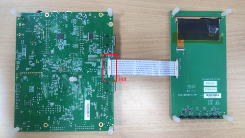

连接 5V 输入到开发板 J43， 跳线连接 J38 的 1-2，电源开关为 SW5，Debug 时使用 Micro-USB 数据线连接电脑与开发板的 J86。整体连接图如下。

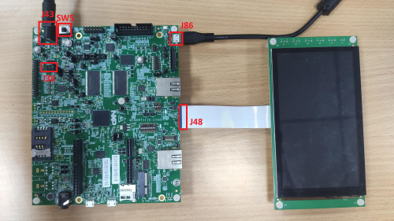

## 软件准备

* 下载[RT-Thread Nano源码](https://www.rt-thread.org/download/nano/rt-thread-3.1.3.zip)并解压。

* 构建并下载[RT1170 SDK](https://mcuxpresso.nxp.com/zh/select)

    1. 选择 MIMXRT1170-EVKB 开发板后，点击构建按钮；
    2. 构建 SDK，通常全选即可，然后点击下载按钮；
    3. 构建成功后，仪表盘会出现对应开发板选项，点击下载按钮，出现下载对话框后点击下载链接，同意使用条款后即可下载。

    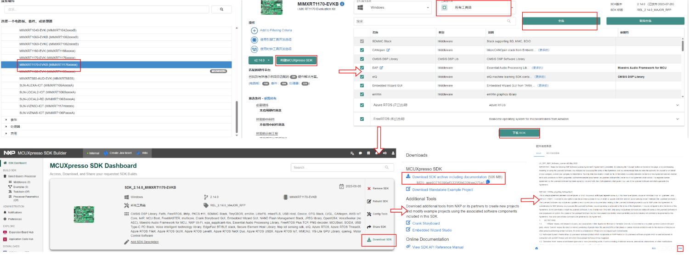

* 解压下载后的 SDK 压缩包，本文将以解压路径下的 /boards/evkbmimxrt1170/vglite_examples/clock_freertos/cm7/ 为例进行 RT-Thread Nano 移植。

* 使用IAR打开该例程下的 ./iar/clock_freertos_cm7.eww ，首先需在工程 /board/display_support.h 中确保当前使用的屏幕与 `DEMO_PANEL` 宏定义的型号一致。

    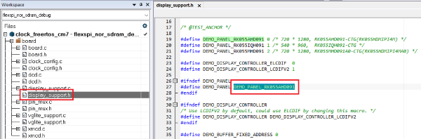

* 编译并运行程序，首先确保原例程可以正常运行，若正常运行则屏幕可显示时钟图像，且串口持续输出帧数信息。

    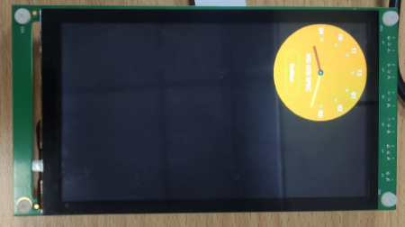

本文中使用的 SDK 版本为 v2.14.0，RT-Thread Nano 版本为 v3.1.3。

## 移植RT-Thread Nano内核到RT1170

### 添加源文件

在 SDK 解压目录下的 /rtos/ 下创建 rt-thread 文件夹，并将 RT-Thread Nano 解压目录中以下文件复制到 /rtos/rt-thread/ 文件夹内：

* /rt-thread/ 文件夹中的 include、libcpu、src 文件夹
* /rt-thread/bsp/ 文件夹中的 board.c 与 rtconfig.h 文件

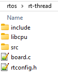

打开 clock_freertos_cm7.eww，新建 rtthread 分组，并在分组中添加以下文件：

* /rtos/rt-thread/src/ 文件夹中所有文件
* /rtos/rt-thread/libcpu/arm/cortex-m7/ 文件夹中 cpuport.c 与 context_iar.S 文件（RT1170 芯片为 Cortex-M7 架构，若对其他开发板移植，需选取芯片对应架构的文件）
* /rtos/rt-thread/ 文件夹中的 board.c，另也可添加 rtconfig.h 文件用于 RT-Thread 配置

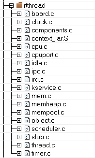

### 添加头文件路径

IAR 中右键工程名点击 Options... 选项，进入下图界面添加以下路径：

* rtconfig.h 头文件所在位置的路径
* RT-Thread 的 include 文件夹下的头文件路径

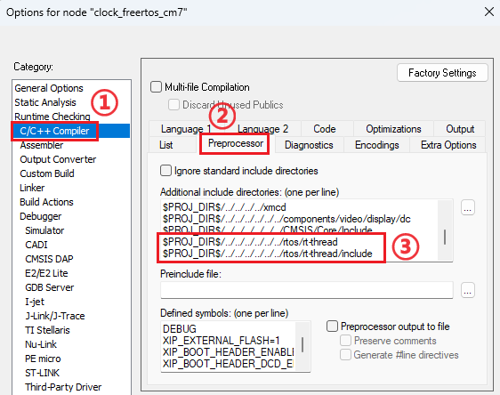

若添加后，路径显示为绝对路径而非以 "\$PROJ_DIR\$" 开头的相对路径，可以先关闭 IAR，使用记事本打开 clock_freertos_cm7.ewp 对相关文本进行搜索替换，再重新打开 IAR。

### 适配RT-Thread Nano

RT-Thread 会接管异常处理函数 `HardFault_Handler()` 和悬挂处理函数 `PendSV_Handler()`，两函数在 context_iar.S 文件中进行了定义。此外，board.c 中的 `SysTick_Handler()` 函数对 OS Tick 进行计数。以上三个函数在原例程的 startup_MIMXRT1176_cm7.s 中也有定义，但均有 `PUBWEAK` 前缀修饰，即为弱函数。此时若例程未使用 FreeRTOS，新旧函数理应不会出现函数重复定义错误。

但因原有工程中的 FreeRTOS 同样接管了原例程的 `PendSV_Handler()` 与 `SysTick_Handler()`，此时编译出现函数重复定义的错误。可先对工程 /source/FreeRTOSConfig.h 中以下两行进行注释，或也可注释掉工程 /freertos/portable/IAR/ARM_CM4F/portasm.s 中 `xPortPendSVHandler()` 与工程 /freertos/portable/IAR/ARM_CM4F/port.c 中 `xPortSysTickHandler()` 的定义，可暂时解决编译错误。在下篇时将会对 FreeRTOS 进行完全移除。

``` C
#define xPortPendSVHandler PendSV_Handler
#define xPortSysTickHandler SysTick_Handler
```

因后续的代码对线程进行动态分配，需在 rtconfig.h 文件中取消下行注释以提供内存堆支持：

``` C
#define RT_USING_HEAP
```

同时，需在工程 /rtthread/board.c 中增大内存堆，更改 `RT_HEAP_SIZE` 宏为 1024 * 10：

``` C
#define RT_HEAP_SIZE (1024 * 10)
```

其余有关 VGLite 的 RT-Thread 配置将在下篇讲解，上篇主要聚焦 RT-Thread Nano 的内核移植。更多配置项可参考 https://www.rt-thread.org/document/site/#/rt-thread-version/rt-thread-nano/nano-config/an0043-nano-config

### 编写测试应用程序

完成以上操作后，首先编写一个简单的 RT-Thread 代码测试内核移植是否正常。备份工程中 /source/colock_freertos.c 的原有代码后，重新编写如下所示测试代码：

``` C
#include "rtthread.h"

#include "fsl_debug_console.h"
#include "pin_mux.h"
#include "clock_config.h"
#include "board.h"

static void test_thread(void *parameter) {
    while (1) {
        PRINTF("Hello RT-Thread\r\n");
        rt_thread_mdelay(500);
    }
}

int main(void) {
    /* Init board hardware. */
    BOARD_ConfigMPU();
    BOARD_BootClockRUN();
    BOARD_InitLpuartPins();
    BOARD_InitDebugConsole();

    rt_thread_t test_thread_handle = rt_thread_create("test_thread", test_thread, RT_NULL, 512, 1, 1);
    if (test_thread_handle != RT_NULL)
        rt_thread_startup(test_thread_handle);
}
```

编译并运行，若开发板每隔 500 毫秒通过串口向 PC 发送 "Hello RT-Thread"， 则说明 RT-Thread Nano 内核移植成功，恭喜已经完成了近一半的路程！

## 移植 Finsh 控制台组件到 RT1170

Finsh 是 RT-Thread 的命令行组件（shell），提供一套可以在命令行调用的操作接口，主要用于调试或查看系统信息。Finsh 控制台组件是可选项，若不需要此组件可跳过此部分。

Finsh 组件移植可分为两部分：添加 UART 控制台实现打印输出、添加 Finsh 组件实现命令输入。

### 添加 UART 控制台实现打印输出

#### UART 初始化

原有工程中，UART 相关初始化由 `main()` 函数中的 `BOARD_InitLpuartPins()`  与 `BOARD_InitDebugConsole()` 函数实现。移植 RT-Thread Nano 后，可将 `main()` 函数中原有的初始化步骤转移到工程 /rtthread/board.c 文件中的 `rt_hw_board_init()` 函数中。转移后的 `rt_hw_board_init()` 函数如下所示。

``` C
#include <board.h>
#include <pin_mux.h>

......

/**
 * This function will initial your board.
 */
void rt_hw_board_init()
{
    /* Init board hardware. */
    BOARD_ConfigMPU();
    BOARD_BootClockRUN();
    
    BOARD_InitLpuartPins();
    BOARD_InitDebugConsole();
    BOARD_InitMipiPanelPins();
    
    ......
}
```

#### rt_hw_console_output() 实现

RT-Thread 使用 `rt_kprintf()` 函数调用 `rt_hw_console_output()` 函数进行打印输出，`rt_hw_console_output()` 函数位于工程 /rtthread/kservice.c 文件中，需要自己实现。此处可以直接继续 include 原工程 /utilities/fsl_debug_console.h 文件, 使用其中的 `PRINTF` 宏进行输出。不过 RT-Thread 的打印均已以 '\n' 结尾，故输出前还需输出 '\r'，以完成回车与换行。实现后的 `rt_hw_console_output()` 函数如下：

``` C
#include <fsl_debug_console.h>

......

RT_WEAK void rt_hw_console_output(const char *str)
{
    PRINTF(str);
    PRINTF("\r");
}
```

#### UART 输出测试

完成以上步骤后，更改上文的 `main()` 函数中的 `PRINTF` 宏为 `rt_kprintf()` 函数，以此测试是否可以正常输出。更改后的代码如下，其中 `main()` 函数原先的初始化操作已转移到了工程 /rtthread/board.c 文件中的 `rt_hw_board_init()` 函数中。

``` C
#include "rtthread.h"

static void test_thread(void *parameter) {
    while (1) {
        rt_kprintf("Hello RT-Thread");
        rt_thread_mdelay(500);
    }
}

int main(void) {
    rt_thread_t test_thread_handle = rt_thread_create("test_thread", test_thread, RT_NULL, 512, 1, 1);
    if (test_thread_handle != RT_NULL)
        rt_thread_startup(test_thread_handle);
}
```

编译并运行，若开发板依旧持续通过串口发送 "Hello RT-Thread"，则证明 `rt_kprintf()` 函数可以正常工作。

### 添加 Finsh 组件实现命令输入

#### 源文件添加

使用 IAR 移植 Finsh，需首先添加 Finsh 源文件。Finsh 源文件位于 RT-Thread Nano 解压目录 /rt-thread/components/finsh/ 内，将 finsh 文件夹复制到 SDK 解压目录 /rtos/rt-thread/ 中。

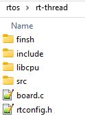

随后，在工程 /rtthread/ 中新建 finsh 分组，添加 finsh 文件夹中所有 .c 文件。


IAR 中右键工程名点击 Options... 选项，进入下图界面添加之前复制的 Finsh 文件夹路径。

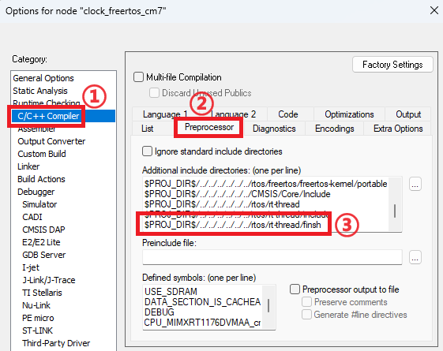

#### 使能 Finsh

添加源文件与头文件路径后，在 rtconfig.h 中 include Finsh 头文件：

``` C
#include "finsh_config.h"
```

rtconfig.h 与 finsh_config.h 中存在部分重复定义的宏，使得编译时出现警告，可注释掉 finsh_config.h 中重复定义的宏。

#### rt_hw_console_getchar() 实现

与 UART 手动实现输出类似，Finsh 中需手动实现工程 /rtthread/finsh/finsh_port.c 中的输入函数 `rt_hw_console_getchar()`。

首先需注释原有的 `rt_hw_console_getchar()` 函数中的 #error "TODO 4: Read a char from the uart and assign it to 'ch'." 语句以停止报错。输入仍然可以使用原工程 /utilities/fsl_debug_console.h 文件中的 `GETCHAR` 宏实现。实现后的 `rt_hw_console_getchar()` 函数如下：

``` C
#include <fsl_debug_console.h>

......

RT_WEAK char rt_hw_console_getchar(void)
{
    /* Note: the initial value of ch must < 0 */
    int ch = -1;

// #error "TODO 4: Read a char from the uart and assign it to 'ch'."
    ch = GETCHAR();
    
    return ch;
}
```

#### Finsh 控制台测试

原有测试代码的输出语句可先注释掉以免影响命令行阅读。编译并运行，使用 PUTTY 等串口工具打开窗口。按下 tab 键，或输入 help 命令并回车，窗口此时会输出相关命令信息。否则说明移植失败，需检查上述步骤完成情况。

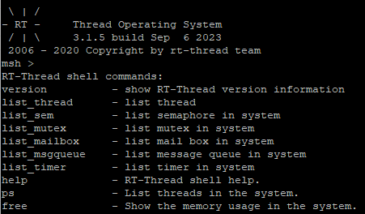

## 小结

上篇主要介绍了如何将 RT-Thread Nano 内核与 Finsh 控制台移植到 i.MX RT1170 EVKB 开发板的 IAR 工程中，为下篇如何移植 VGLite 到 RT-Thread Nano 提供了内核基础。

有关更多 RT-Thread 的官方文档可访问 https://www.rt-thread.org/document/site/#/

我们下篇不见不散！

## 参考教程

* https://www.rt-thread.org/document/site/#/rt-thread-version/rt-thread-nano/nano-port-iar/an0040-nano-port-iar

* https://www.rt-thread.org/document/site/#/rt-thread-version/rt-thread-nano/finsh-port/an0045-finsh-port