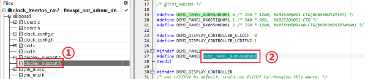
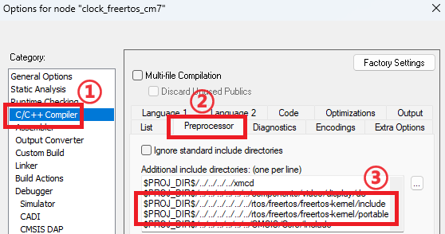
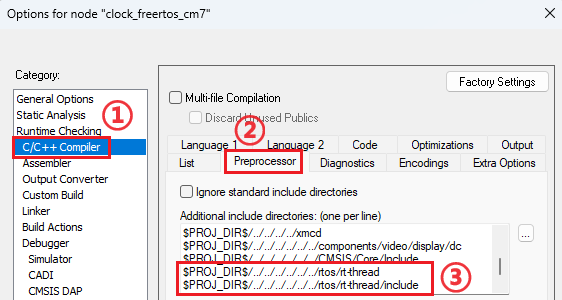
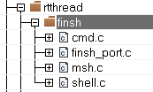
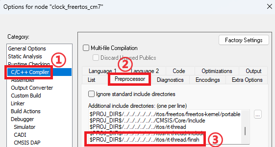

# i.MX RT1170：VGLite 移植 RT-Thread Nano 教程（上）

RT-Thread 是国人自主研发的开源实时操作系统（ RTOS ），RT-Thread Nano 是极简版的硬实时内核，内存占用小，移植简单。VGLite 是 NXP 提供的轻量级 2D 图形 API，基于 FreeRTOS 实现。

文章分为上、下两篇，将手把手教您移植 VGLite 到 RT-Thread Nano。上篇对 RT-Thread Nano 内核与 Finsh 组件进行移植，下篇则教您如何改写官方 SDK 中 VGLite example 的代码，使其从原有的 FreeRTOS 适配到 RT-Thread Nano 中。

文章所做的工作已上传至 Github ，欢迎有兴趣的读者学习交流！

## 硬件准备

本文采用 i.MX RT1170 EVKB 开发板与 RK055HDMIPI4M 显示屏，显示屏与开发板 J48 相连，使用 MIPI DSI 协议通信，连接方式如图。


连接 5V 输入到开发板 J43， 跳线连接 J38 的 1-2，电源开关为 SW5，Debug 时使用 Micro-USB 数据线连接电脑与开发板的 J86。整体连接图如下。


## 软件准备

* 下载[RT-Thread Nano源码](https://www.rt-thread.org/download/nano/rt-thread-3.1.3.zip)并解压。
* 构建并下载 [RT1170 SDK](https://mcuxpresso.nxp.com/zh/select)。
* 解压 SDK 压缩包，使用 IAR 打开 /boards/evkbmimxrt1170/vglite_examples/clock_freertos/cm7/iar/clock_freertos_cm7.eww，后续以此为例进行移植。
* 需在工程 /board/display_support.h 中确保当前屏幕与 `DEMO_PANEL` 宏定义的型号一致。

    
* 编译并运行，正常运行时屏幕显示时钟图像，且串口持续输出帧数信息。

    

NOTE: 本文中使用的 SDK 版本为 v2.14.0，RT-Thread Nano 为 v3.1.3，IAR 为 9.40.1。

## FreeRTOS 移除

首先删除原工程中的 freertos 组与 /source/FreeRTOSConfig.h 文件。


右键工程名点击 Options... 选项，在下图界面可删除 FreeRTOS 头文件路径：



全局搜索代码中以下 FreeRTOS 相关头文件，注释或删除：

``` C
#include "FreeRTOS.h"
#include "task.h"
#include "semphr.h"
#include "queue.h"
```

因原有的 VGLite 源文件仍在调用移除的 FreeRTOS 函数，会导致编译报错。可先右键以下文件后点击 Options... 选项，选择 Exclude from build 排除编译。

* /board/display_support.c 与 .h 文件
* /board/vglite_support.c 与 .h 文件
* /source/vglite_window.c 与 .h 文件
* /elementary/ 组
* /vglite/ 组
* /video/ 组


既然已移除了 FreeRTOS，那么文件名中的 "freertos" 也可更换掉，比如 "clock_freertos.eww" 可改为 "clock_rtthread.eww"。此外，.ewd、.ewp、.eww 文件中有关 "freertos" 的文本也可用记事本等搜索替换。

## 移植 RT-Thread Nano 内核到 RT1170

### 添加源文件

在 SDK 解压包的 /rtos/ 中创建 rt-thread 文件夹，并将 RT-Thread Nano 解压包中以下文件复制到 /rtos/rt-thread/ 文件夹内。

* /rt-thread/ 文件夹中的 include、libcpu、src 文件夹
* /rt-thread/bsp/ 文件夹中的 board.c 与 rtconfig.h 文件


打开 clock_rtthread.eww，新建 rtthread 组并添加以下文件：

* /rtos/rt-thread/src/ 文件夹中所有文件
* /rtos/rt-thread/libcpu/arm/cortex-m7/ 文件夹中 cpuport.c 与 context_iar.S 文件（RT1170 芯片为 Cortex-M7 架构，若对其他开发板移植，需选取芯片对应架构的文件）
* /rtos/rt-thread/ 文件夹中的 board.c，也可添加 rtconfig.h 文件方便 RT-Thread 配置


### 添加头文件路径

IAR 中右键工程名点击 Options... 选项，进入下图界面添加以下路径：

* rtconfig.h 头文件所在位置的路径
* RT-Thread 的 include 文件夹下的头文件路径



若添加的路径为绝对路径而非以 "\$PROJ_DIR\$" 开头的相对路径，可以先关闭 IAR，使用记事本打开 clock_rtthread.ewp 进行搜索替换，再重新打开 IAR。

### 配置 RT-Thread Nano
<!--
RT-Thread 会接管异常处理函数 `HardFault_Handler()` 和悬挂处理函数 `PendSV_Handler()`，两函数在 context_iar.S 文件中进行了定义。此外，board.c 中的 `SysTick_Handler()` 函数对 OS Tick 进行计数。以上三个函数在原例程的 startup_MIMXRT1176_cm7.s 中也有定义，但均有 `PUBWEAK` 前缀修饰，即为弱函数。此时若例程未使用 FreeRTOS，新旧函数理应不会出现函数重复定义错误。

但因原有工程中的 FreeRTOS 同样接管了原例程的 `PendSV_Handler()` 与 `SysTick_Handler()`，此时编译出现函数重复定义的错误。可先对工程 /source/FreeRTOSConfig.h 中以下两行进行注释，或也可注释掉工程 /freertos/portable/IAR/ARM_CM4F/portasm.s 中 `xPortPendSVHandler()` 与工程 /freertos/portable/IAR/ARM_CM4F/port.c 中 `xPortSysTickHandler()` 的定义，可暂时解决编译错误。在下篇时将会对 FreeRTOS 进行完全移除。

``` C
#define xPortPendSVHandler PendSV_Handler
#define xPortSysTickHandler SysTick_Handler
```
-->

后续的代码需对线程动态分配，故在 rtconfig.h 文件中取消下行注释以提供内存堆支持：

``` C
#define RT_USING_HEAP
```

同时，需在工程 /rtthread/board.c 中增大内存堆，更改 `RT_HEAP_SIZE` 宏为 (1024 * 10)：

``` C
#define RT_HEAP_SIZE (1024 * 10)
```

其余 RT-Thread 配置将在下篇讲解，上篇主要聚焦内核移植所用到的配置。

### 编写测试应用程序

编写一个简单的 RT-Thread 代码以测试移植的内核。备份工程中 /source/colock_freertos.c 的原有代码后，更改为以下测试代码：

``` C
#include "rtthread.h"
#include "fsl_debug_console.h"
#include "pin_mux.h"
#include "clock_config.h"
#include "board.h"

static void test_thread(void *parameter) {
    while (1) {
        PRINTF("Hello RT-Thread\r\n");
        rt_thread_mdelay(500);
    }
}
int main(void) {
    /* Init board hardware. */
    BOARD_ConfigMPU();
    BOARD_BootClockRUN();
    BOARD_InitLpuartPins();
    BOARD_InitDebugConsole();

    rt_thread_t test_thread_handle = rt_thread_create("test_thread", test_thread, RT_NULL, 512, 1, 1);
    if (test_thread_handle != RT_NULL)
        rt_thread_startup(test_thread_handle);
}
```

编译并运行，若开发板每隔 500 毫秒通过串口发送 "Hello RT-Thread"， 则说明内核移植成功，恭喜您已完成了近一半的路程！

## 移植 Finsh 控制台组件到 RT1170

Finsh 是 RT-Thread 的命令行组件（shell），提供一套可以在命令行调用的操作接口。此组件是可选项，若不需要可跳过此章节。

Finsh 移植分为两部分：添加 UART 控制台实现打印输出、添加 Finsh 组件实现命令输入。

### 添加 UART 控制台实现打印输出

#### UART 初始化

原工程中，UART 等初始化在 `main()` 函数中完成。移植 RT-Thread Nano 后，可将初始化转移到工程 /rtthread/board.c 中的 `rt_hw_board_init()` 函数中，如下所示。

``` C
#include <board.h>
#include <pin_mux.h>
......
void rt_hw_board_init() {
    /* Init board hardware. */
    BOARD_ConfigMPU();
    BOARD_BootClockRUN();
    BOARD_InitLpuartPins();
    BOARD_InitDebugConsole();
    BOARD_InitMipiPanelPins();
    ......
}
```

#### rt_hw_console_output() 实现

RT-Thread 使用 `rt_kprintf()` 调用 `rt_hw_console_output()` 函数打印输出，此函数位于工程 /rtthread/kservice.c 文件中，需要自己实现。可以直接 include 原工程 /utilities/fsl_debug_console.h 文件, 使用 `PRINTF` 宏输出。不过打印已以 '\n' 结尾，故还需输出 '\r'，以完成回车与换行。实现后的函数如下：

``` C
#include <fsl_debug_console.h>
......
RT_WEAK void rt_hw_console_output(const char *str) {
    PRINTF(str);
    PRINTF("\r");
}
```

#### UART 输出测试

更改 `PRINTF` 宏为 `rt_kprintf()` 函数，以此测试是否正常输出。更改的代码如下，原先的初始化操作已转移到了工程 /rtthread/board.c 的 `rt_hw_board_init()` 函数中。

``` C
#include "rtthread.h"

static void test_thread(void *parameter) {
    while (1) {
        rt_kprintf("Hello RT-Thread");
        rt_thread_mdelay(500);
    }
}
int main(void) {
    rt_thread_t test_thread_handle = rt_thread_create("test_thread", test_thread, RT_NULL, 512, 1, 1);
    if (test_thread_handle != RT_NULL)
        rt_thread_startup(test_thread_handle);
}
```

编译并运行，若开发板仍持续通过串口发送 "Hello RT-Thread"，则可正常输出。

### 添加 Finsh 组件实现命令输入

#### 源文件添加

Finsh 源文件位于 RT-Thread Nano 解压包的 /rt-thread/components/finsh/ 内，将 finsh 文件夹复制到 SDK 解压包的 /rtos/rt-thread/ 中。


在工程 /rtthread 组中新建 finsh 组，添加复制的 finsh 文件夹中所有 .c 文件。



IAR 中右键工程名点击 Options... 选项，添加 finsh 文件夹路径。



#### 使能 Finsh

在 rtconfig.h 中 include 添加的 Finsh 头文件：

``` C
#include "finsh_config.h"
```

rtconfig.h 与 finsh_config.h 中存在部分重复的宏，可注释掉 finsh_config.h 中重复的宏以避免编译时的警告。

#### rt_hw_console_getchar() 实现

也需手动实现工程 /rtthread/finsh/finsh_port.c 中的函数 `rt_hw_console_getchar()` 用于命令输入。

注释原有的 `rt_hw_console_getchar()` 函数中的 #error 开头语句以停止报错。可用原工程 /utilities/fsl_debug_console.h 文件中的 `GETCHAR` 宏实现输入，函数如下：

``` C
#include <fsl_debug_console.h>
......
RT_WEAK char rt_hw_console_getchar(void) {
    int ch = -1;
    ch = GETCHAR();
    return ch;
}
```

#### Finsh 控制台测试

编译并运行，使用 PUTTY 等工具打开串口。按下 tab 键或输入 help 命令并回车，会输出以下信息。否则说明移植失败，需再检查上述步骤。


## 小结

上篇主要介绍了如何移植 RT-Thread Nano 内核与 Finsh 控制台，为下篇讲解移植 VGLite 到 RT-Thread Nano 提供了内核基础。

我们下篇不见不散！

## 参考教程

* https://www.rt-thread.org/document/site/#/rt-thread-version/rt-thread-nano/nano-port-iar/an0040-nano-port-iar
* https://www.rt-thread.org/document/site/#/rt-thread-version/rt-thread-nano/finsh-port/an0045-finsh-port