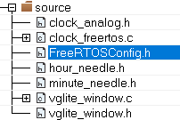

# i.MX RT1170：VGLite 移植 RT-Thread Nano 教程（下）

上篇介绍了如何移植国产实时操作系统 RT-Thread Nano 内核与 Finsh 控制台到 i.MX RT1170 EVKB 开发板上。本文继续上篇，介绍如何将 NXP 官方的 VGLite API 从 FreeRTOS 移植到 RT-Thread Nano 上。

## RT-Thread 配置

rtconfig.h 文件可对 RT-Thread 进行配置，因 VGLite 例程会使用到互斥量、消息队列、堆管理等，故需取消以下内容的注释：

``` C
#define RT_USING_MUTEX
#define RT_USING_MESSAGEQUEUE
#define RT_USING_HEAP
```

RT-Thread 原先开启的邮箱机制在本工程中并不使用，可以注释掉：

``` C
// #define RT_USING_MAILBOX
```

RT-Thread Nano 的默认最大名称长度为 8，此处可以更改为 16 以容纳更长名称。

``` C
#define RT_NAME_MAX    16
```

原有的 FreeRTOS 设置 tick 频率为 200，RT-Thread Nano 中默认的 tick 频率为 1000，可调整为 200 与原工程一致。

``` C
#define RT_TICK_PER_SECOND  200
```

## FreeRTOS 与 RT-Thread 对比

首先分析 FreeRTOS 与 RT-Thread 之间的一些区别，以帮助后续用 RT-Thread API 对 FreeRTOS API 替换改写。

### 任务与线程

FreeRTOS 称运行中的线程为“任务”（ task ），而RT-Thread直接称其为“线程”（ thread ），这一术语尚未达成共识，两者其实只是同一事物的不同表述。

### 任务（线程）优先级

FreeRTOS 中，优先级范围为 0 到 `configMAX_PRIORITIES - 1`，`configMAX_PRIORITIES` 在 FreeRTOSConfig.h 文件中定义，优先级数字越低则该任务优先级越低。

RT-Thread 中，优先级范围为 0 到 `RT_THREAD_PRIORITY_MAX - 1`，`RT_THREAD_PRIORITY_MAX` 在 rtconfig.h 文件中定义，优先级数字越低则该线程优先级越高，这一点与 FreeRTOS 相反。

### 任务（线程）调度

FreeRTOS 中，通常手动调用 `vTaskStartScheduler()` 函数开启全局任务调度器。无论任务是在此函数调用前后创建，一旦创建便直接参与调度运行。时间片轮转调度时，各相同优先级线程的单次运行时间片统一为 1，即 1 个 tick 便会调度一次。

RT-Thread 中，系统初始化时就已自动调用 `rt_system_scheduler_init()` 与 `rt_system_scheduler_start()` 函数开启任务调度器，无需手动开启。创建或初始化后的线程位于初始状态，并不会直接运行，初始状态的每个函数均需调用 `rt_thread_startup()` 才会参与调度。时间片轮转调度时，各相同优先级线程的单次运行时间片在创建线程时可指定为不同 tick。

### 中断适用函数

FreeRTOS 中，出于效率与代码简洁性考虑，涉及上下文切换的函数存在两个 API 版本。一种是用于在任务中调用的常规版本；另一种则用于在中断内调用，通常以 `FromISR()` 结尾。此外，若中断调用的 `FromISR()` 结尾 API 唤醒了更高优先级的线程，其会将输入的 `pxHigherPriorityTaskWoken` 变量赋值为 `pdTRUE` ，再需手动调用 `portYIELD_FROM_ISR(xHigherPriorityTaskWoken)` ，以此在中断退出时唤醒高优先级线程。

RT-Thread 中，并未区分线程与中断之间不同的 API 版本，线程与中断可使用同一 API。但中断内不能使用挂起当前线程的操作，若使用则会打印 "Function [xxx_func] shall not used in ISR" 的提示信息。若中断内函数唤醒了更高优先级的线程，则在中断退出会自动切换到高优先级线程，无需手动切换。

### 线程本地数据

FreeRTOS 中，线程的本地数据为一个数组，数组长度由 FreeRTOSConfig.h 文件中的 `configNUM_THREAD_LOCAL_STORAGE_POINTERS` 宏进行配置。

RT-Thread 中，线程的本地数据为一个 `uint32` 格式的 `user_data` 变量，而非数组。若要在本地存储数组、结构体等数据，可将对应结构的地址存入该变量中。

### 信号量

FreeRTOS 中，分为二值信号量与计数信号量两种。二值信号量最大值为 1 ，初值为 0 。每个计数信号量的最大值和初值均可在创建时指定。

RT-Thread 中，未区分二值信号量与计数信号量，且仅能指定信号量初值，最大值统一为 65535 ，无法指定。此外，信号量在创建时可选先入先出模式（ `RT_IPC_FLAG_FIFO` ）和优先级模式（ `RT_IPC_FLAG_PRIO` ），通常情况选用优先级模式保证线程实时性。

### 互斥量

FreeRTOS 中，除创建的 API 以外，互斥量的结构体与持有、释放与删除所使用的 API ，与信号量所用的相同。

RT-Thread 中，互斥量拥有一套独立的 API ，而非与信号量共用 API 。

### Tick

FreeRTOS 中 `portTICK_PERIOD_MS` 宏 与 RT-Thread 中 `RT_TICK_PER_SECOND` 宏，名字相似但代表含义恰好相反，容易混淆。

FreeRTOS 中 `portTICK_PERIOD_MS` 宏的定义为 `((TickType_t)1000/configTICK_RATE_HZ)` ，代表两个 ticks 间隔多少 ms；而 RT-Thread 中 `RT_TICK_PER_SECOND` 宏代表每秒产生多少个 ticks，其代表的含义与 FreeRTOS 中的 `configTICK_RATE_HZ` 相一致，即 tick 频率。

### 头文件

FreeRTOS 中，当使用信号量、互斥量、队列等机制时，除 FreeRTOS.h 外，需额外 include 其他对应的头文件。

RT-Thread 中，通常仅需 include rtthread.h 文件即可使用信号量、互斥量、队列等机制。

## FreeRTOS 移除

在上篇 RT-Thread Nano 移植成功后可将原有的 FreeRTOS 移除，首先可删除工程中的 freertos 组。


再移除工程中 /source/FreeRTOSConfig.h 文件。



IAR 中右键工程名点击 Options... 选项，进入下图界面可删除 FreeRTOS 头文件路径：


最后全局搜索代码中以下 FreeRTOS 相关头文件，注释或删除：

``` C
#include "FreeRTOS.h"
#include "task.h"
#include "semphr.h"
#include "queue.h"
```

根据以上操作移除 FreeRTOS 后，编译工程会因原有的 FreeRTOS 函数未定义而报错，随后使用 RT-Thread 函数改写所有 FreeRTOS 函数。

## VGLite 代码改写

<!-- 
根据上文的对比，下表详细总结了 本工程中涉及到的 FreeRTOS 与 RT-Thread API、结构体、宏的对应关系。

| FreeRTOS                           | RT-Thread                 | 备注     |
| :--                                | :--                       | :--      |
| **API**                            |
| xTaskCreate                        | rt_thread_create          | 两者优先级数字代表高低不同。前者时间片流转长度统一为 1 tick，后者可指定不同时间片长度，若两者 tick 频率相等，则后者全部线程的时间片可设置为 1。 |
| vTaskDelete                        | rt_thread_delete          | 前者输入 NULL 即删除当前线程，后者删除当前线程时需传入 rt_thread_self()。 |
| vTaskStartScheduler                | rt_thread_startup         | 前者直接打开全局调度器，创建的线程直接运行，后者仅使输入线程开始运行。 |
| xSemaphoreCreateCounting or <br> xSemaphoreCreateBinary | rt_sem_create | 前者区分二进制与计数型，可指定初值与最大值；后者仅指定初值，且需设置名称与排队方式。 |
| xSemaphoreCreateMutex              | rt_mutex_create           |
| xSemaphoreTake                     | rt_sem_take or <br> rt_mutex_take |
| xSemaphoreGive or <br> xSemaphoreGiveFromISR            | rt_sem_release or <br> rt_mutex_release |
| vSemaphoreDelete                   | rt_sem_delete or <br> rt_mutex_delete |
| xQueueCreate                       | rt_mq_create              |
| uxQueueMessagesWaiting             | 无，rt_mq_t->entry 可代替  |
| xQueueReceive                      | rt_mq_recv                |
| xQueueSend                         | rt_mq_send or <br> rt_mq_send_wait |
| portYIELD_FROM_ISR                 | 自动实现                   |
| vTaskSetThreadLocalStoragePointer  | 无，需手动实现             |
| pvTaskGetThreadLocalStoragePointer | 无，需手动实现             |
| pvPortMalloc                       | rt_malloc                 |
| vPortFree                          | rt_free                   |
| vTaskDelay                         | rt_thread_delay or <br> rt_thread_mdelay |
| portENTER_CRITICAL                 | rt_enter_critical         |
| portEXIT_CRITICAL                  | rt_exit_critical          |
| **结构体**                                                      |
| TaskHandle_t                       | rt_thread_t               |
| QueueHandle_t                      | rt_mq_t                   |
| SemaphoreHandle_t                  | rt_sem_t or <br> rt_mutex_t  |
| **宏**                                                         |
| pdTRUE                             | RT_EOK                    |
| portMAX_DELAY                      | RT_WAITING_FOREVER        |

以上表格只能描述两种间的大致对应关系，具体的入参、返回值等仍存在一定差异。
-->

首先将上篇因编写测试代码而备份的 /source/clock_freertos.c 代码恢复回去。

### 头文件更改

工程在以下文件中会使用到RT-Thread，需包含头文件 `#include "rtthread.h"` ：

* /source/clock_freertos.c 
* /vglite/VGLite/rtos/vg_lite_os.c （较多改动）
* /vglite/VGLiteKernel/rtos/vg_lite_hal.c
* /vglite/font/vft_draw.c
* /elementary/src/elm_os.c 
* /elementary/src/velm.h
* /video/fsl_fbdev.h
* /video/fsl_dc_fb_lcdifv2.c
* /video/fsl_video_common.c
* /utilities/fsl_debug_console.c

### 线程 API 改写

FreeRTOS 中的 `xTaskCreate()` 可由 RT-Thread 中的 `rt_thread_create()` 替换。需注意因两个 RTOS 优先级数字代表的高低相反，故需进行转换。`rt_thread_create()` 中可指定线程单次运行的时间片，若 RT-Thread 已设置 tick 频率与原 FreeRTOS 相等，则时间片可全部设置为 1 。 `TaskHandle_t` 结构体由 `rt_thread_t` 代替。

而原有的 `vTaskStartScheduler()` 应被删除，改用 `rt_thread_startup()` 启动指定线程。

此外，命名中的 "task" 可替换为 "thread" 以符合 RT-Thread 规范。`vTaskDelete(NULL)` 为删除当前线程，RT-Thread 可用 `rt_thread_delete(rt_thread_self())` 代替。

/source/clock_freertos.c 更改的线程相关代码对比主要如下：（篇幅所限，仅列举代表性的例子，下同）

``` C
xTaskCreate(vglite_task, "vglite_task", configMINIMAL_STACK_SIZE + 200, NULL, configMAX_PRIORITIES - 1, NULL)
^^^^^^
rt_thread_t vglite_thread_handle = rt_thread_create("vglite_thread", vglite_thread, RT_NULL, 1024, 0, 1);
```
``` C
vTaskStartScheduler();
^^^^^^
if (vglite_thread_handle != RT_NULL)
    rt_thread_startup(vglite_thread_handle);
```
``` C
static void vglite_task(void *pvParameters)
^^^^^^^
static void vglite_thread(void *parameter)
```

/vglite/VGLite/rtos/vg_lite_os.c 更改的线程相关代码主要如下：

``` C
#define QUEUE_TASK_PRIO  (configMAX_PRIORITIES - 1)
^^^^^^^
#define QUEUE_THREAD_PRIO  0
```

``` C
#define QUEUE_TASK_NAME    "queue_task"
^^^^^^^
#define QUEUE_THREAD_NAME  "queue_thread"
```

``` C
TaskHandle_t    task_hanlde;
^^^^^^^
rt_thread_t     task_hanlde;
```
``` C
vTaskDelete(NULL);
^^^^^^^
rt_thread_delete(rt_thread_self());
```
``` C
ret = xTaskCreate(command_queue, QUEUE_TASK_NAME, QUEUE_TASK_SIZE, NULL, QUEUE_TASK_PRIO, &os_obj.task_hanlde);
^^^^^^^
os_obj.task_hanlde = rt_thread_create(QUEUE_THREAD_NAME, command_queue, NULL, QUEUE_THREAD_SIZE, QUEUE_THREAD_PRIO, 1);
if (os_obj.task_hanlde != RT_NULL)
    rt_thread_startup(os_obj.task_hanlde);
```

### 信号量 API 改写

FreeRTOS 的 `xSemaphoreCreateCounting()` 与 `xSemaphoreCreateBinary()` 均可使用 `rt_sem_create()` 代替，但 `rt_sem_create()` 需设置名称，无需设置最大值，初值通常为 0，均采用 `RT_IPC_FLAG_PRIO` 模式。 `SemaphoreHandle_t` 结构体需换为 `rt_sem_t` 。

`xSemaphoreTake()` 函数可替换为 `rt_sem_take()` 函数，FreeRTOS 中的 `portMAX_DELAY` 代表无限等待，可换为 Rt-Thread 中的 `RT_WAITING_FOREVER` 。若原 FreeRTOS 中指定过期时间形如 `timeout / portTICK_PERIOD_MS`，应使用 `(rt_int32)((rt_int64)timeout * RT_TICK_PER_SECOND / 1000)` 替换。

判断返回值由 `pdTRUE` 替换为 `RT_EOK` 。 `xSemaphoreGive()` 函数换为 `rt_sem_release()` 。 `vSemaphoreDelete()` 函数使用 `rt_sem_delete()` 替换。有关中断内调用的信号量相关函数 `xSemaphoreGiveFromISR()` ，在下文再进行详细讲解替换。

以 /vglite/VGLite/rtos/vg_lite_os.c 为例，更改的信号量代码对比主要如下：

``` C
SemaphoreHandle_t semaphore[TASK_LENGTH] = {NULL};
^^^^^^^
rt_sem_t semaphore[THREAD_LENGTH] = {NULL};
```
``` C
command_semaphore = xSemaphoreCreateCounting(30,0);
^^^^^^^
command_semaphore = rt_sem_create("cs", 0, RT_IPC_FLAG_PRIO);
```
``` C
int_queue = xSemaphoreCreateBinary();
^^^^^^^
int_queue = rt_sem_create("iq", 0, RT_IPC_FLAG_PRIO);
```
``` C
if (xSemaphoreTake(semaphore[event->semaphore_id], portMAX_DELAY) == pdTRUE)
^^^^^^^
if (rt_sem_take(semaphore[event->semaphore_id], RT_WAITING_FOREVER) == RT_EOK)
```
``` C
if (xSemaphoreTake(int_queue, timeout / portTICK_PERIOD_MS) == pdTRUE)
^^^^^^^
if (rt_sem_take(int_queue, (rt_int32_t) ((rt_int64_t)timeout * RT_TICK_PER_SECOND / 1000)) == RT_EOK)
```
``` C
if(xSemaphoreGive(command_semaphore) != pdTRUE)
^^^^^^^
if(rt_sem_release(command_semaphore) != RT_EOK)
```
``` C
vSemaphoreDelete(semaphore[event->semaphore_id]);
^^^^^^^
rt_sem_delete(semaphore[event->semaphore_id]);
```

以下文件同样需对信号量相关函数与结构体进行改写，均可参考以上例子：

* /video/fsl_fbdev.h
* /video/fsl_fbdev.c
* /vglite/VGLiteKernel/rtos/vg_lite_hal.c

### 互斥量 API 改写

`xSemaphoreCreateMutex()` 函数替换为 `rt_mutex_create()` ，需指定名称与排队方式，通常为 `RT_IPC_FLAG_PRIO` `。SemaphoreHandle_t` 结构体替换为 `rt_mutex_t` 。

其他互斥量的改写过程与信号量基本一致。`xSemaphoreTake()` 、`xSemaphoreGive()` 、`vSemaphoreDelete()` 替换为 `rt_mutex_take()` 、`rt_mutex_release()` 、`rt_mutex_delete()` 。

/vglite/VGLite/rtos/vg_lite_os.c 中，更改的互斥量代码对比主要如下：
``` C
static SemaphoreHandle_t mutex;
^^^^^^^
static rt_mutex_t mutex;
```
``` C
mutex = xSemaphoreCreateMutex();
^^^^^^^
mutex = rt_mutex_create("mut", RT_IPC_FLAG_PRIO);
```
``` C
if(xSemaphoreTake(mutex, TASK_WAIT_TIME/portTICK_PERIOD_MS) == pdTRUE)
^^^^^^^
if(rt_mutex_take(mutex, (rt_int32_t) ((rt_int64_t)MAX_MUTEX_TIME * RT_TICK_PER_SECOND / 1000)) != RT_EOK)
```
``` C
xSemaphoreGive(mutex);
^^^^^^^
rt_mutex_release(mutex);
```
``` C
vSemaphoreDelete(mutex);
^^^^^^^
rt_mutex_delete(mutex);
```

### 消息队列 API 改写

`xQueueCreate()` 函数替换为 `rt_mq_create()` ，需指定名称与排队方式，通常为 `RT_IPC_FLAG_PRIO` 。 `QueueHandle_t` 结构体替换为 `rt_mq_t` 。

RT-Thread 暂无与 `uxQueueMessagesWaiting()` 类似的函数，但 `rt_mq_t` 结构体中的 `entry` 变量表示队列中存在的消息数，可以用 `if (xxx->entry)`代替。

`xQueueReceive()` 、 `xQueueSend()` 函数更换为 `rt_mq_recv()` 、 `rt_mq_send_wait()` ，需额外指定发送与接收消息的大小。同时也需注意过期时间的转换。

/vglite/VGLite/rtos/vg_lite_os.c 中，更改的消息队列代码对比主要如下：
``` C
QueueHandle_t queue_handle;
^^^^^^^
rt_mq_t       queue_handle;
```
``` C
os_obj.queue_handle = xQueueCreate(QUEUE_LENGTH, sizeof(vg_lite_queue_t * ));
^^^^^^^
os_obj.queue_handle = rt_mq_create("queue_vglite", sizeof(vg_lite_queue_t * ), QUEUE_LENGTH, RT_IPC_FLAG_PRIO);
```
``` C
if(uxQueueMessagesWaiting(os_obj.queue_handle))
^^^^^^^
if(os_obj.queue_handle->entry)
```
``` C
ret = xQueueReceive(os_obj.queue_handle, (void*) &peek_queue, TASK_WAIT_TIME/portTICK_PERIOD_MS);
^^^^^^^
ret = rt_mq_recv(os_obj.queue_handle, (void*) &peek_queue, os_obj.queue_handle->msg_size, (rt_int32_t) ((rt_int64_t)TASK_WAIT_TIME * RT_TICK_PER_SECOND / 1000));
```
``` C
if(xQueueSend(os_obj.queue_handle, (void *) &queue_node, ISR_WAIT_TIME/portTICK_PERIOD_MS) != pdTRUE)
^^^^^^^
if(rt_mq_send_wait(os_obj.queue_handle, (void *) &queue_node, os_obj.queue_handle->msg_size, (rt_int32_t) ((rt_int64_t)ISR_WAIT_TIME * RT_TICK_PER_SECOND / 1000)) != RT_EOK)
```

### 中断内 API 改写

对于信号量，FreeRTOS 中断内采用 `xSemaphoreGiveFromISR()` 函数保证中断安全，且需根据 `xHigherPriorityTaskWoken` 变量，使用 `portYIELD_FROM_ISR()` 来手动切换上下文；而 RT-Thread 仍使用通用的 `rt_sem_release()` 函数，且可自动切换上下文，无需手动执行。

/vglite/VGLite/rtos/vg_lite_os.c 中，更改的中断内代码对比主要如下：

``` C
portBASE_TYPE xHigherPriorityTaskWoken = pdFALSE;
xSemaphoreGiveFromISR(int_queue, &xHigherPriorityTaskWoken);
if(xHigherPriorityTaskWoken != pdFALSE )
    portYIELD_FROM_ISR(xHigherPriorityTaskWoken);
^^^^^^^
rt_sem_release(int_queue);
```

以下文件同样需对信号量相关函数与结构体进行改写，可参考以上例子：

* /video/fsl_fbdev.c

### 内存管理 API 改写

`pvPortMalloc()` 代替为 `rt_malloc()` ，`vPortFree()` 代替为 `rt_free()` 即可。

以下文件需对内存管理相关函数进行改写：

* /vglite/VGLite/rtos/vg_lite_os.c
* /vglite/font/vft_draw.c
* /elementary/src/velm.h

### 临界区资源 API 改写

`portENTER_CRITICAL()` 与 `portEXIT_CRITICAL()` 需替换为 `rt_enter_critical()` 与 `rt_exit_critical()` 。

以下文件需对临界区资源相关函数进行改写：

* /video/fsl_fbdev.c

### 时间相关 API 改写

`vTaskDelay()` 延时函数可替换为 `rt_thread_delay()` 。若用于延时指定毫秒，也可直接使用 `rt_thread_mdelay()` 代替，无需再计算毫秒对应的 tick。

`xTaskGetTickCount()` 用于得到 tick 的计数值，可用 `rt_tick_get()` 函数代替。

/source/clock_freertos.c 更改的时间相关代码对比如下：

``` C
return (uint32_t)(xTaskGetTickCount() * portTICK_PERIOD_MS);
^^^^^^^
return (rt_tick_t)((rt_uint64_t)rt_tick_get() * 1000 / RT_TICK_PER_SECOND);
```

/vglite/VGLite/rtos/vg_lite_os.c 中，更改的毫秒延时相关代码对比主要如下：

``` C
vTaskDelay((configTICK_RATE_HZ * msec + 999)/ 1000);
^^^^^^^
rt_thread_mdelay(msec);
```

以下文件也需对延时相关函数进行改写，均可参考以上例子：

* /video/fsl_dc_fb_lcdifv2.c
* /video/fsl_video_common.c
* /utilities/fsl_debug_console.c

### 线程本地数据 API 改写

FreeRTOS 每个线程存在一个 32 位数组作为本地数据，而 RT-Thread 中每个线程只存在一个名为 `user_data` 的 32 位变量作为本地数据。原有的 FreeRTOS 本地数据中仅使用了数组中第一个元素，若用 RT-Thread 仅改写 VGLite API，则可以直接用该 `uint32` 变量保存原数组中第一个元素（如果是除 clock_freertos 以外的其他未使用 Elementary 的例程）。

但本文使用的 clock_freertos 例程中同时使用了 Elementary，Elementary 也需要在本地数据中存放一个 32 位变量，则此时需要在本地存放两个变量。若使用 RT-Thread Nano 故需先为两个变量开辟一个数组 `tls_array` ，再将数组地址存放于线程本地的 `user_data` 变量中。

在 /vglite/VGLite/rtos/vg_lite_os.c 中新建数组 `tls_array` 并添加 `vg_lite_os_init_tls_array()` 、 `vg_lite_os_deinit_tls_array()` 函数，再在 /vglite/VGLite/rtos/vg_lite_os.h 中声明两个函数：`vg_lite_os_init_tls_array()` 初始化函数中将数组地址存入了当前线程的 `user_data` 变量；`vg_lite_os_deinit_tls_array()` 函数则相反，将当前线程 `user_data` 变量中的数组地址删除。

``` C
#define TLS_ARRAY_LENGTH    2
rt_uint32_t tls_array[TLS_ARRAY_LENGTH] = {NULL};

int32_t vg_lite_os_init_tls_array(void)
{
    rt_thread_t rt_TCB;
    
    rt_TCB = rt_thread_self();
    RT_ASSERT( rt_TCB != NULL );

    rt_TCB->user_data = (rt_uint32_t) tls_array;

    return VG_LITE_SUCCESS;
}

void vg_lite_os_deinit_tls_array(void)
{
    rt_thread_t rt_TCB;
    
    rt_TCB = rt_thread_self();
    RT_ASSERT( rt_TCB != NULL );
    rt_TCB->user_data = NULL;
}
```

再对 /vglite/VGLite/rtos/vg_lite_os.c 中 `vg_lite_os_get_tls()` 、`vg_lite_os_set_tls()` 、`vg_lite_os_reset_tls()` 进行修改，原例程中直接调用了 FreeRTOS 的 `pvTaskGetThreadLocalStoragePointer()` 与 `vTaskSetThreadLocalStoragePointer()` 函数获取与修改本地线程数据，而新代码需手动实现，获取当前线程本地数据并读写数组第一位元素：

``` C
void * vg_lite_os_get_tls()
{
    // return pvTaskGetThreadLocalStoragePointer(NULL, 0);
    ^^^^^^^
    rt_thread_t rt_TCB;
    void * pvReturn = NULL;
    rt_TCB = rt_thread_self();
    rt_uint32_t * tls_ptr = (rt_uint32_t *) rt_TCB->user_data;
    pvReturn = (void *) (*tls_ptr);
    return pvReturn;
}
```
``` C
int32_t vg_lite_os_set_tls(void* tls)
{
    ......
    // vTaskSetThreadLocalStoragePointer(NULL, 0, tls);
    ^^^^^^^
    rt_thread_t rt_TCB;
    rt_TCB = rt_thread_self();
    RT_ASSERT( rt_TCB != NULL );
    rt_uint32_t * tls_ptr = (rt_uint32_t *) rt_TCB->user_data;
    *tls_ptr = (rt_uint32_t) tls;
    ......
}
```
``` C
void vg_lite_os_reset_tls()
{
    // vTaskSetThreadLocalStoragePointer(NULL, 0, NULL);
    ^^^^^^^
    rt_thread_t rt_TCB;
    
    rt_TCB = rt_thread_self();
    RT_ASSERT( rt_TCB != NULL );

    rt_uint32_t * tls_ptr = (rt_uint32_t *) rt_TCB->user_data;
    *tls_ptr = NULL;
}
```

随后更改工程 /vglite/VGLite/vg_lite.c 中 `vg_lite_init()` 函数，在调用 `vg_lite_os_get_tls()` 、`vg_lite_os_malloc()` 、`vg_lite_os_set_tls()` 等函数之前，添加上文定义的 `vg_lite_os_init_tls_array()` 函数进行线程本地数据初始化：

``` C
vg_lite_error_t vg_lite_init(int32_t tessellation_width,
                             int32_t tessellation_height)
{
    ......
    error = (vg_lite_error_t)vg_lite_os_init_tls_array();
    ......
}
```

同样，在工程 /vglite/VGLite/vg_lite.c 的 `vg_lite_close()` 函数中，在调用 `vg_lite_os_reset_tls()` 等函数的最后，添加上文定义的 `vg_lite_os_deinit_tls_array()` 函数：

``` C
vg_lite_error_t vg_lite_close(void)
{
    ......
    vg_lite_os_deinit_tls_array();
    ......
}
```

### Elementary API 改写

使用 Elementary 时，同样也需对工程 /elementary/src/elm_os.c 中的 `elm_os_get_tls()` 、 `elm_os_set_tls()` 、`elm_os_reset_tls()` 函数进行修改，以读写线程本地数据数组的第二位，与 VGLite 中函数改写方法相似，主要将 `*tls_ptr` 替换为 `*(tls_ptr + 1)` 。

``` C
vg_lite_error_t elm_os_get_tls(void* tls)
{
    // return pvTaskGetThreadLocalStoragePointer(NULL, 1);
    ^^^^^^^
    rt_thread_t rt_TCB;
    void * pvReturn = NULL;
    rt_TCB = rt_thread_self();
    rt_uint32_t * tls_ptr = (rt_uint32_t *)rt_TCB->user_data;
    pvReturn = (void *) *(tls_ptr + 1);
    return pvReturn;
}
```
``` C
vg_lite_error_t elm_os_set_tls(void* tls)
{
    ......
    // vTaskSetThreadLocalStoragePointer(NULL, 1, tls);
    ^^^^^^^
    rt_thread_t rt_TCB;
    rt_TCB = rt_thread_self();
    RT_ASSERT( rt_TCB != NULL );
    rt_uint32_t * tls_ptr = (rt_uint32_t *)rt_TCB->user_data;
    *(tls_ptr + 1) = (rt_uint32_t) tls;
    ......
}
```
``` C
void elm_os_reset_tls(void)
{
    // vTaskSetThreadLocalStoragePointer(NULL, 1, NULL);
    ^^^^^^^
    rt_thread_t rt_TCB;
    rt_TCB = rt_thread_self();
    RT_ASSERT( rt_TCB != NULL );
    rt_uint32_t * tls_ptr = (rt_uint32_t *)rt_TCB->user_data;
    *(tls_ptr + 1) = NULL;
}
```

### 数据类型改写

FreeRTOS 定义了 `TickType_t` 与 `BaseType_t` 类型，在 RT1170 中，可分别使用 RT-Thread 定义的 `rt_uint32_t` 与 `rt_err_t` 代替。同时，若判断 RT-Thread 对象是否为空，可用 `RT_NULL` 代替 `NULL` 。

以下文件需对数据类型进行改写：

* /vglite/VGLite/rtos/vg_lite_os.c
* /video/fsl_fbdev.c （在中断函数中因不再需要手动切换上下文，也可直接删除 `BaseType_t` 变量）
* /video/fsl_video_common.c （若用于延时指定毫秒，也可直接删除用于转换毫秒的 `TickType_t` 变量与计算过程，直接使用 `rt_thread_mdelay()` 函数）

### 输出 API 改写

若在上篇中移植了 Finsh 控制台组件，则可用 `rt_kprintf()` 代替 `PRINTF` 宏。 `rt_kprintf()` 已自动在字符串末尾添加 "\r\n" 进行回车与换行，无需再手动添加。

## 结果验证

编译并运行，若屏幕出现指针不断旋转的时钟，且串口会打印帧数。恭喜， VGLite 与 Elementary 已成功移植到 RT-Thread Nano 上！


## 总结

VGLite 移植到 RT-Thread Nano 的过程还是较为繁琐，需要更改掉的 FreeRTOS API 较多，但两个 RTOS 的大部分特性相似度较高，难度不大。经过两篇文章的学习，相信您对于 FreeRTOS、RT-Thread 以及 VGLite 的细节有了更深入的了解。

此外，也可以使用 [FreeRTOS-Wrapper](https://github.com/RT-Thread-packages/FreeRTOS-Wrapper) 兼容层替换 FreeRTOS，读者可以自行进行研究。

## 参考教程

* https://www.rt-thread.org/document/api/index.html

* https://www.rt-thread.org/document/site/#/rt-thread-version/rt-thread-standard/programming-manual/basic/basic

* https://www.rt-thread.org/download/manual/um4003-rtthread-programming-manual.pdf

* https://freertos.org/zh-cn-cmn-s/FreeRTOS-quick-start-guide.html

* https://freertos.org/fr-content-src/uploads/2018/07/161204_Mastering_the_FreeRTOS_Real_Time_Kernel-A_Hands-On_Tutorial_Guide.pdf

* https://freertos.org/fr-content-src/uploads/2018/07/FreeRTOS_Reference_Manual_V10.0.0.pdf